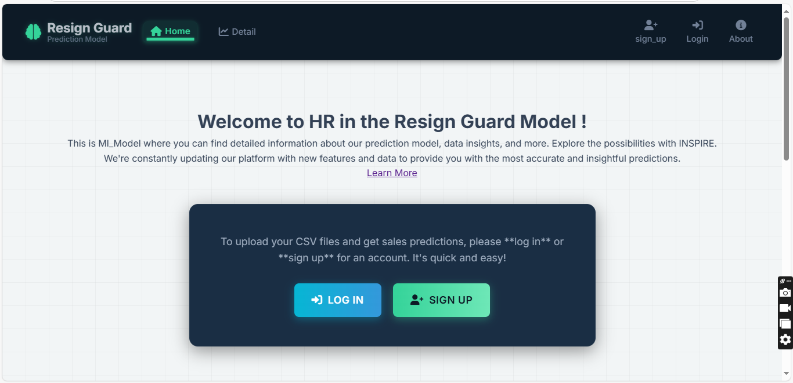
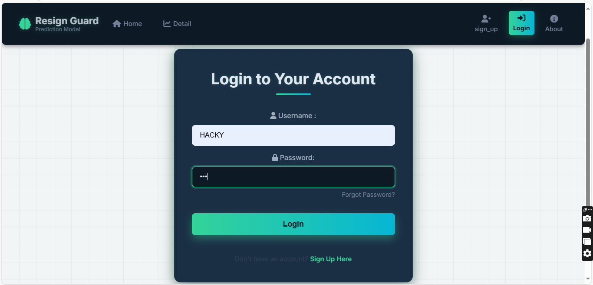
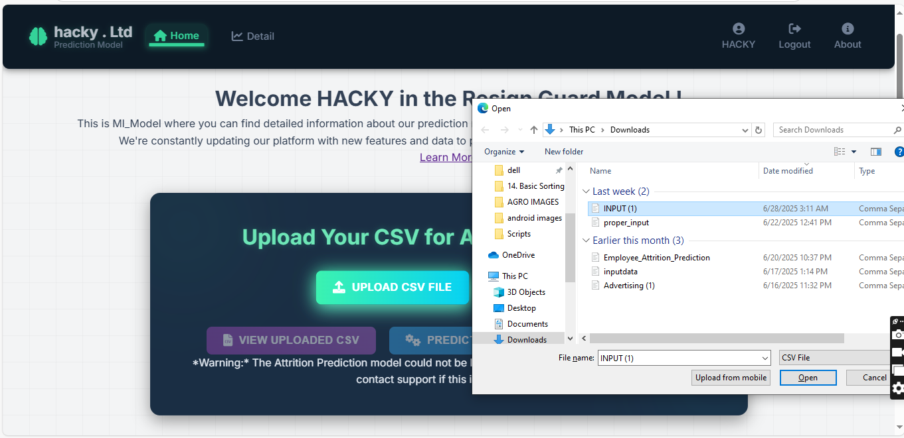
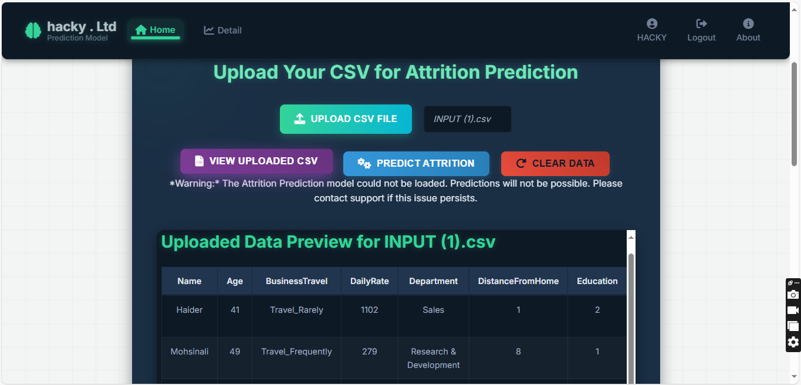
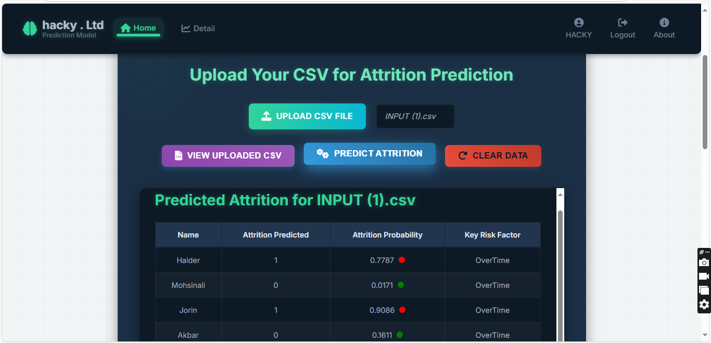
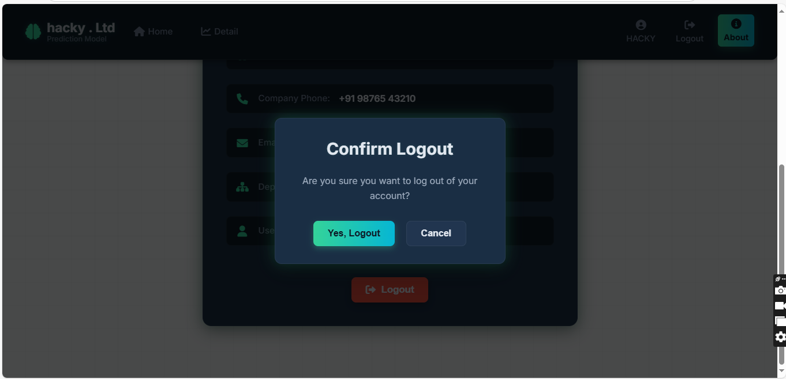

1] This is <strong> LAUNCHING PAGE</strong> of website  

  

2] This is <strong>HOME</strong> page  

  

3] This is <strong>LOGIN</strong> page before any file upload 

  

4] This is <strong>HOME</strong> page  after LOG_IN successfully

  

5] This is <strong>VIEW UPLOADED DATA</strong>

  

6] This is <strong>PREDICTED DATA</strong>   

  

7] This is <strong>LOGOUT</strong> page

  

